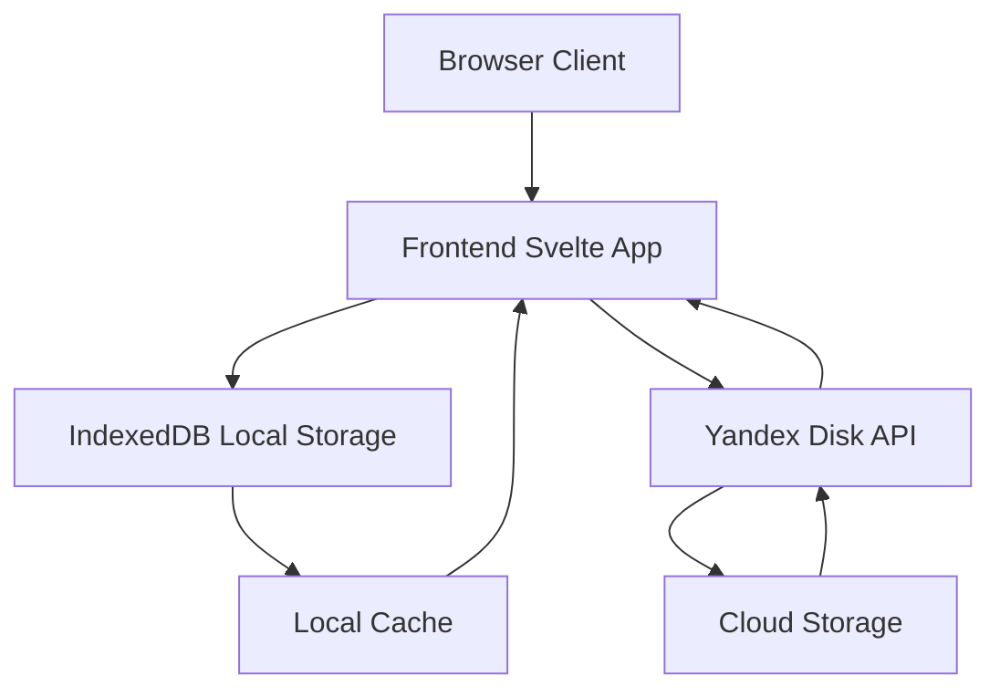
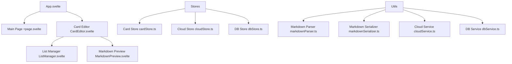
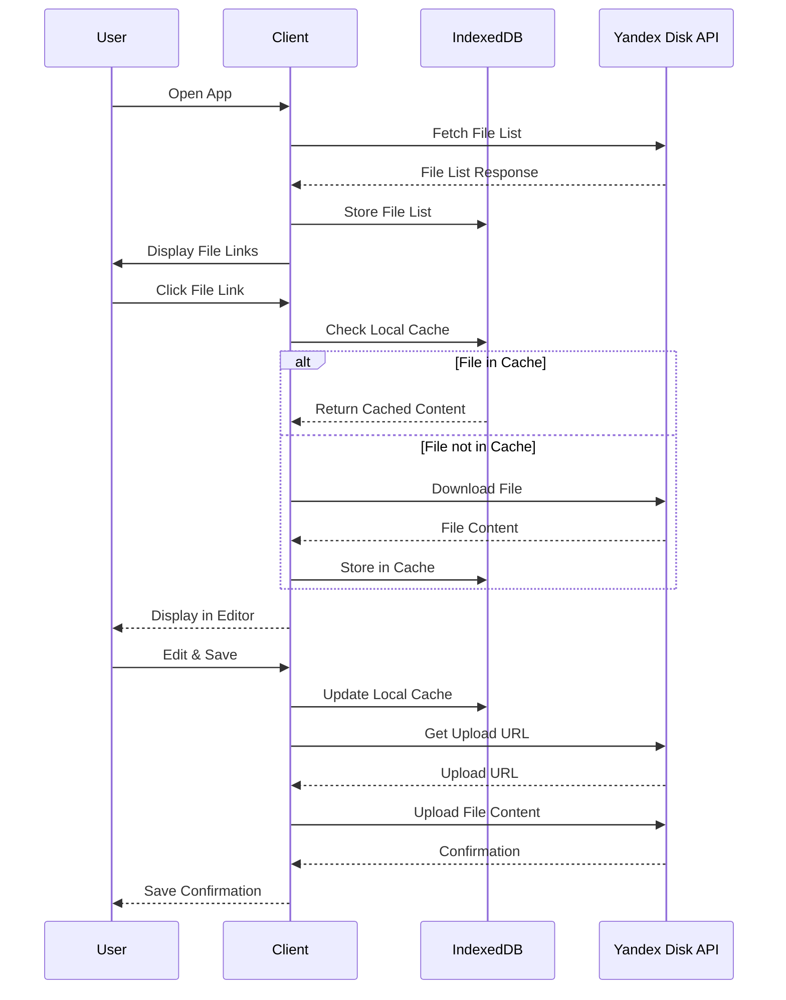

# Cloud-Based Markdown Card Editor with Yandex Disk Integration

## Architecture Overview

## Component Structure

## Data Flow

## Implementation Steps

### 1. Core Infrastructure
- Create IndexedDB service for local storage
- Create Yandex Disk API service for cloud operations
- Implement authentication mechanism for Yandex OAuth

### 2. Data Management
- Enhance existing stores to work with both local and cloud storage
- Implement synchronization logic between local and cloud storage
- Add offline capability with automatic sync when online

### 3. UI Components
- Modify main page to show cloud files
- Enhance editor to handle cloud save operations
- Add cloud status indicators (sync status, online/offline)

### 4. API Integration
- Implement file listing from Yandex Disk
- Implement file download from Yandex Disk
- Implement file upload to Yandex Disk

## File Modifications Needed

1. **src/lib/stores/cardStore.ts** - Enhance with cloud integration
2. **src/routes/+page.server.ts** - Modify to fetch from cloud instead of local files
3. **src/routes/+page.svelte** - Update to display cloud files
4. **src/lib/components/CardEditor.svelte** - Add cloud save functionality
5. **src/routes/api/files/+server.ts** - Replace with cloud integration
6. **src/routes/api/save/+server.ts** - Replace with cloud integration
7. **src/routes/markdown/[filename]/+server.ts** - Replace with cloud integration

## New Files to be Created

1. **src/lib/services/cloudService.ts** - Yandex Disk API integration
2. **src/lib/services/dbService.ts** - IndexedDB service
3. **src/lib/stores/cloudStore.ts** - Cloud state management
4. **src/lib/stores/dbStore.ts** - Local database state management
5. **src/lib/types/cloud.ts** - Cloud-related type definitions
6. **src/routes/api/cloud/[operation]/+server.ts** - Cloud API endpoints

## Detailed Implementation Plan

### Phase 1: Infrastructure Setup
1. Create IndexedDB service for local caching
2. Create Yandex Disk API service
3. Implement authentication handling
4. Set up cloud and database stores

### Phase 2: Data Management
1. Enhance card store with cloud integration
2. Implement synchronization logic
3. Add offline support
4. Create data consistency checks

### Phase 3: UI Integration
1. Modify main page to show cloud files
2. Enhance editor with cloud save
3. Add status indicators
4. Implement error handling UI

### Phase 4: API Integration
1. Replace file listing with cloud version
2. Replace file download with cloud version
3. Replace file upload with cloud version
4. Add error handling and retry logic

### Phase 5: Testing & Refinement
1. Test offline functionality
2. Test synchronization
3. Verify data consistency
4. Optimize performance
