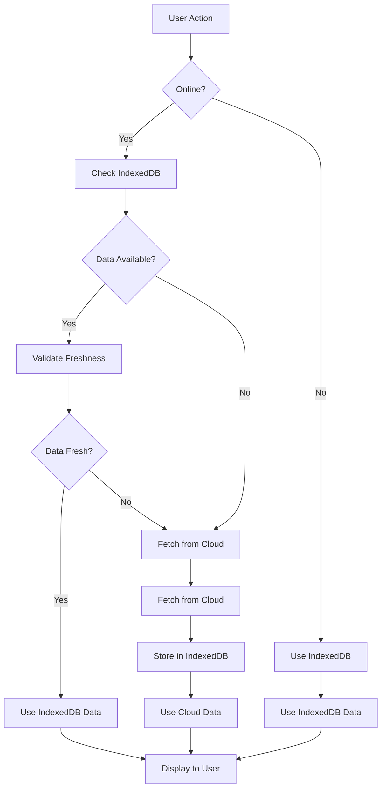

# IndexedDB Enhancement Implementation Plan

## Overview
This document outlines the technical approach for enhancing the application to prioritize IndexedDB for card operations while maintaining cloud synchronization. The implementation will build upon the existing IndexedDB infrastructure while adding new features for performance optimization, offline support, and improved user experience.

## Current Architecture Analysis
The application already has a solid foundation with:
- `DBService` for IndexedDB operations
- `CloudService` for Yandex Disk integration
- Svelte stores for state management
- Server-side API routes for cloud operations

## Enhancement Strategy

### 1. Initial Load & Storage
**Current Implementation:**
- Cloud files are fetched via API and cached in IndexedDB
- Cards are loaded on-demand when accessed

**Enhanced Implementation:**
- On main page load, fetch all card content from cloud and store in IndexedDB
- Implement background sync to keep local cache updated
- Add progress indicators for initial sync

### 2. Display Optimization
**Current Implementation:**
- Main page displays card IDs as titles
- No local title extraction

**Enhanced Implementation:**
- Extract titles from card content during initial sync
- Store titles in IndexedDB for fast retrieval
- Display actual card titles instead of IDs

### 3. Single Card Route Optimization
**Current Implementation:**
- Cards are loaded from cloud with local caching
- No explicit IndexedDB-first approach

**Enhanced Implementation:**
- Read card content from IndexedDB first
- Only fetch from cloud if not found locally or if outdated
- Implement smart cache validation

### 4. Dual Sync Mechanism
**Current Implementation:**
- Cards saved to both local cache and cloud
- Basic error handling

**Enhanced Implementation:**
- Ensure all modifications are saved to both stores
- Implement transactional approach to maintain consistency
- Add sync status tracking

### 5. Fallback Mechanism
**Current Implementation:**
- Basic fallback to local cache
- Limited error handling

**Enhanced Implementation:**
- Comprehensive fallback strategies
- Graceful degradation when IndexedDB is unavailable
- Automatic recovery when services become available

### 6. Error Handling & Retries
**Current Implementation:**
- Basic error logging
- No retry mechanisms

**Enhanced Implementation:**
- Robust error handling for all IndexedDB operations
- Exponential backoff retry strategies
- User feedback for failed operations

### 7. Performance Monitoring
**Current Implementation:**
- No performance tracking

**Enhanced Implementation:**
- Track load times for IndexedDB and cloud operations
- Monitor performance against defined thresholds (100ms for IndexedDB, 1000ms for cloud)
- Log performance metrics for optimization

### 8. Cache Management
**Current Implementation:**
- Basic caching with no validation

**Enhanced Implementation:**
- Periodic validation of IndexedDB data against cloud
- Conflict resolution strategies
- Stale entry removal

### 9. Offline Mode
**Current Implementation:**
- Limited offline capabilities
- No sync queuing

**Enhanced Implementation:**
- Full offline functionality
- Queue modifications for sync when online
- Visual offline indicator

### 10. User Feedback
**Current Implementation:**
- Basic loading states
- No data source indicators

**Enhanced Implementation:**
- Clear notifications about data loading sources
- Visual indicators for sync status
- User-friendly error messages

## Technical Implementation Details

### Data Flow Architecture

### Service Layer Enhancements

#### DBService Enhancements
1. Add performance timing for all operations
2. Implement retry mechanisms with exponential backoff
3. Add batch operations for improved efficiency
4. Enhance error handling with detailed error types

#### CloudService Enhancements
1. Add offline detection
2. Implement request queuing for offline operations
3. Add performance monitoring
4. Enhance error handling

### Store Layer Enhancements

#### CardStore Enhancements
1. Implement IndexedDB-first loading strategy
2. Add sync status tracking
3. Implement offline queue management
4. Add performance monitoring hooks

#### CloudStore Enhancements
1. Add offline mode detection
2. Implement sync queue
3. Add performance monitoring
4. Enhance error handling with user feedback

### Component Layer Enhancements

#### MainPage Enhancements
1. Display actual card titles from IndexedDB
2. Add loading progress indicators
3. Add data source indicators
4. Add offline status indicator

#### CardEditor Enhancements
1. Implement optimistic UI updates
2. Add sync status indicators
3. Add offline mode notifications
4. Implement retry mechanisms

## Implementation Phases

### Phase 1: Core Infrastructure
- Enhance DBService with performance monitoring and error handling
- Implement initial load and storage of card content
- Add display optimization for main page

### Phase 2: Data Synchronization
- Implement dual sync mechanism
- Add fallback mechanisms
- Enhance error handling and retries

### Phase 3: Offline Support
- Implement offline mode detection
- Add sync queuing functionality
- Add visual offline indicators

### Phase 4: User Experience
- Add user feedback for data loading sources
- Implement performance monitoring
- Add cache management

## Testing Strategy
1. Unit tests for all service layer enhancements
2. Integration tests for data synchronization
3. Offline mode simulation tests
4. Performance benchmarking
5. User experience validation

## Rollout Plan
1. Implement and test in development environment
2. Deploy to staging with feature flag
3. Gradual rollout to production with monitoring
4. Full release after validation

## Success Metrics
1. Reduced main page load times
2. Improved offline user experience
3. Reduced cloud API calls
4. High cache hit rates
5. Low error rates
6. Positive user feedback
